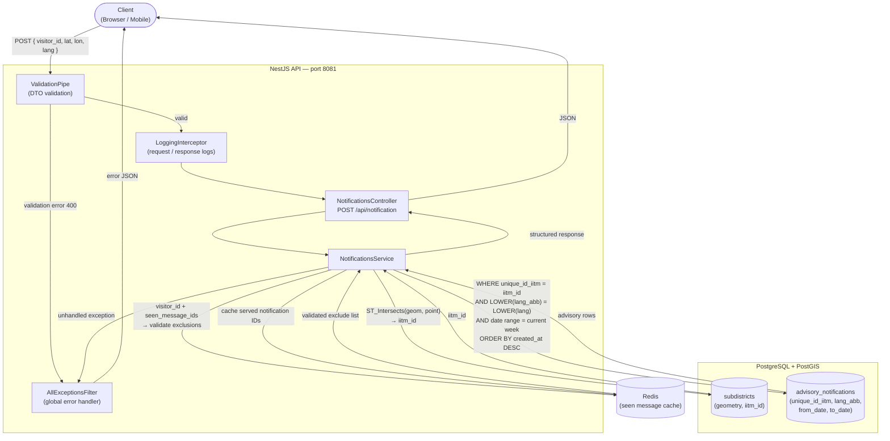

# OAN Notification Service

A NestJS microservice that delivers geo-targeted agricultural advisories to farmers. Given a GPS coordinate and language preference, it resolves the subdistrict via PostGIS, fetches the current week's IITM advisories, and returns structured notifications.

---

## Architecture



---

## Request / Response Flow

1. **Validate** — `ValidationPipe` checks all fields on the incoming DTO. Returns `400` with field-level messages on failure.
2. **Resolve subdistrict** — PostGIS `ST_Intersects` query on the `subdistricts` table maps the lat/lon to an `iitm_id`.
3. **Validate seen IDs** — If `visitor_id` + `seen_message_ids` are provided, only IDs that were previously served to that visitor are excluded (prevents clients from suppressing arbitrary IDs).
4. **Fetch advisories** — Queries `advisory_notifications` by `unique_id_iitm`, language (case-insensitive), and current week date range, ordered by `created_at DESC`.
5. **Cache served IDs** — Stores returned notification IDs in Redis under the visitor's key (7-day TTL) for future deduplication.
6. **Respond** — Returns a typed JSON response with notification type, priority, content, and location metadata.

---

## API Reference

### `POST /api/notification`

**Request body**

| Field             | Type       | Required | Description                                            |
|-------------------|------------|----------|--------------------------------------------------------|
| `visitor_id`      | `string`   | No       | FingerprintJS visitor ID (20–64 chars) for dedup       |
| `lat`             | `number`   | Yes      | Latitude (-90 to 90)                                   |
| `lon`             | `number`   | Yes      | Longitude (-180 to 180)                                |
| `lang`            | `string`   | Yes      | 2-character ISO language code (`en`, `hi`, `gu`, etc.) |
| `seen_message_ids`| `string[]` | No       | UUID v4 array of previously seen notification IDs      |

**Success response**

```json
{
  "success": true,
  "recipient": {
    "visitor_id": "abc123...",
    "lang_code": "en",
    "lat": 12.9281,
    "lon": 77.5550
  },
  "count": 1,
  "notifications": [
    {
      "notification_id": "uuid",
      "type": "WEATHER_ADVISORY",
      "priority": "HIGH",
      "valid_from": "2026-05-17T00:00:00.000Z",
      "valid_to": "2026-05-23T00:00:00.000Z",
      "created_at": "2026-05-21T10:00:00.000Z",
      "content": {
        "title": "Weather Advisory - Ukhimath",
        "body": "..."
      },
      "location": {
        "subdistrict_name": "Ukhimath",
        "district_name": "Rudra Prayag",
        "state_name": "Uttarakhand"
      },
      "metadata": {
        "source": "IITM",
        "template": "2bin_v2_bv",
        "unique_id_iitm": "5546678",
        "unique_id_pm_kisan": 799
      }
    }
  ],
  "error": null
}
```

**Notification types**

| Type               | Priority | When                                                      |
|--------------------|----------|-----------------------------------------------------------|
| `WEATHER_ADVISORY` | `HIGH`   | Template matches weather/season keywords (rain, monsoon…) |
| `GENERAL`          | `LOW`    | All other templates                                       |

**Error response (400)**

```json
{
  "statusCode": 400,
  "message": ["lang must be a 2-character ISO code (e.g. en, hi, gu)"],
  "error": "BadRequestException",
  "path": "/api/notification",
  "timestamp": "2026-05-21T10:00:00.000Z"
}
```

---

### `GET /api/health`

Returns database connectivity, system memory, CPU, disk, and ORM status.

---

## Environment Variables

Copy `.env.example` to `.env` and fill in your values.

| Variable       | Default       | Description                                     |
|----------------|---------------|-------------------------------------------------|
| `NODE_ENV`     | `development` | `development` / `production`                    |
| `PORT`         | `3000`        | HTTP port                                       |
| `DB_HOST`      | `localhost`   | PostgreSQL host                                 |
| `DB_PORT`      | `5432`        | PostgreSQL port                                 |
| `DB_USERNAME`  | `postgres`    | PostgreSQL user                                 |
| `DB_PASSWORD`  | —             | PostgreSQL password                             |
| `DB_DATABASE`  | `oan_notification` | Database name                              |
| `REDIS_HOST`   | `localhost`   | Redis host                                      |
| `REDIS_PORT`   | `6379`        | Redis port                                      |
| `CORS_ORIGINS` | (all)         | Comma-separated allowed origins                 |
| `LOG_LEVEL`    | `debug`       | Pino log level (`debug`, `info`, `warn`, `error`) |

---

## Prerequisites

- Node.js 18+
- PostgreSQL 14+ with **PostGIS** extension
- Redis 6+

The database must have:
- `subdistricts` table with `geom geometry(Geometry,3857)` and `iitm_id bigint` columns
- `advisory_notifications` table (managed by TypeORM sync in non-production)

---

## Setup

```bash
# Install dependencies
npm install

# Copy and configure environment
cp .env.example .env

# Development (watch mode with nodemon)
npm run start:dev

# Production build
npm run build
npm run start:prod
```

---

## Docker

```bash
docker-compose up --build
```

The compose file starts the API alongside PostgreSQL (with PostGIS) and Redis.

---

## Project Structure

```
src/
├── common/
│   ├── filters/          # Global exception filter
│   ├── interceptors/     # Request logging interceptor
│   └── pipes/            # Global validation pipe
├── config/               # App / DB / Redis config factories
├── database/             # TypeORM module setup
├── health/               # Health check endpoints
├── notifications/
│   ├── dto/              # GetAdvisoryDto
│   ├── entities/         # AdvisoryNotification entity
│   ├── enums/            # NotificationType, Priority
│   ├── utils/            # Notification type & priority classifiers
│   ├── notifications.controller.ts
│   ├── notifications.module.ts
│   └── notifications.service.ts
├── redis/                # Redis module & service
└── main.ts
```

---

## Scripts

| Command              | Description                  |
|----------------------|------------------------------|
| `npm run start:dev`  | Development with hot reload  |
| `npm run start:prod` | Production (compiled JS)     |
| `npm run build`      | Compile TypeScript           |
| `npm run lint`       | ESLint with auto-fix         |
| `npm run test`       | Unit tests                   |
| `npm run test:e2e`   | End-to-end tests             |
| `npm run test:cov`   | Test coverage report         |
